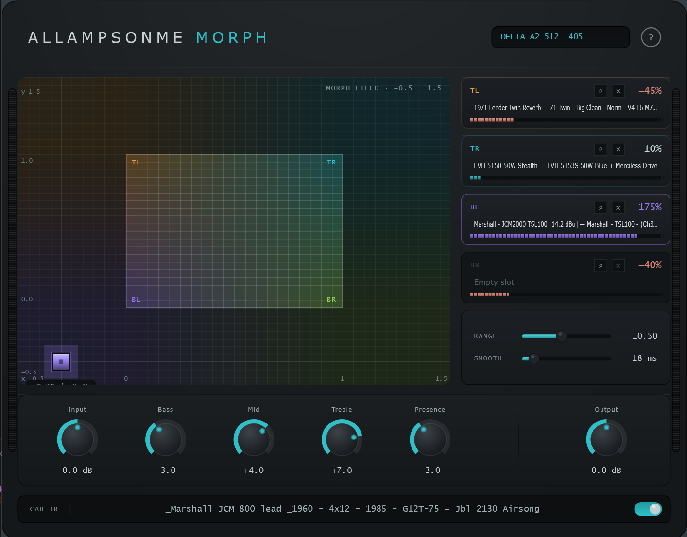

# AllAmpsOnMe Morph (`amp_morph`)



AllAmpsOnMe Morph is a VST3 / AU / Standalone amp plugin that morphs between
four amp or pedal captures in real time on a 2D XY pad.

## Highlights

- Four-corner morphing with live bilinear blending
- Pasteable profile slots with search and filtering
- Cabinet IR loader (WAV), zero-latency FFT convolution
- APVTS-backed controls for morph, gain, and EQ
- JUCE + CMake project with VST3, AU, and Standalone builds

## Build

```sh
cmake -S . -B build
cmake --build build --target amp_morph_VST3
```

## How it works

- A NAM (Neural Amp Modeler) network, trained in junction with an embedding table for each .nam capture produces a general purpose NAM network that can emulate different amp profile by selecting the right embedding.
- The network can produce hundreds of audio profiles (405 in this first iteration) solely by changing the embedding—a 128/256/512-dimension array of fp32 numbers.


For the full design and implementation notes, see
[projects/AAOM/README.md](projects/AAOM/README.md).
